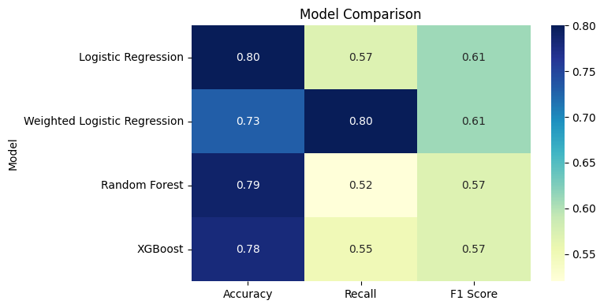
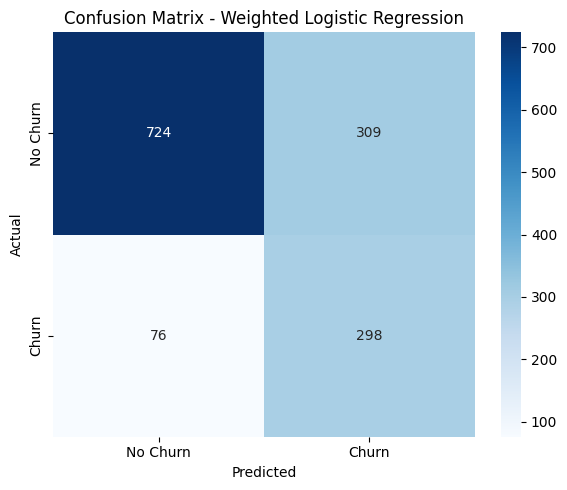

# Customer Churn Prediction using Machine Learning

## Project Overview

Customer churn is a critical business problem for subscription-based companies. Retaining existing customers is often more cost-effective than acquiring new ones.

In this project, I built a machine learning pipeline to predict customer churn using the Telco Customer Churn dataset. Multiple classification algorithms were trained and compared to identify the most suitable model for detecting customers at risk of leaving.

---

## Business Objective

The primary goal was not simply to maximize accuracy, but to identify as many churn-prone customers as possible.

For churn prediction, missing a customer who is likely to leave can be more costly than incorrectly flagging a customer who stays. Therefore, churn recall was prioritized during model selection.

---

## Dataset

**Dataset:** Telco Customer Churn Dataset

**Target Variable:**

- Churn = 1 → Customer left the company
- Churn = 0 → Customer retained

**Dataset Size:**

- 7,032 customer records
- 20 original features

---

## Project Workflow

### 1. Data Understanding

- Examined dataset structure
- Checked feature types
- Identified missing values
- Reviewed target variable distribution

### 2. Exploratory Data Analysis (EDA)

Performed detailed analysis on:

- Customer tenure
- Monthly charges
- Total charges
- Contract types
- Internet services
- Additional service subscriptions
- Churn distribution

### 3. Statistical Analysis

Conducted hypothesis testing to verify whether important features differed significantly between churned and retained customers.

### 4. Feature Engineering

- Missing value handling
- Data cleaning
- One-Hot Encoding
- Feature Scaling using StandardScaler
- Train-Test Split

### 5. Machine Learning Models

The following classification models were trained and evaluated:

- Logistic Regression
- Weighted Logistic Regression
- K-Nearest Neighbors (KNN)
- Random Forest
- XGBoost

---

## Model Performance

| Model | Accuracy | Recall (Churn) |
|---------|---------|---------|
| Logistic Regression | 0.80 | 0.57 |
| Weighted Logistic Regression | 0.73 | 0.80 |
| KNN | 0.75 | 0.53 |
| Random Forest | 0.79 | 0.52 |
| XGBoost | 0.78 | 0.55 |

---

## Final Model Selection

### Weighted Logistic Regression

Although Weighted Logistic Regression achieved lower overall accuracy than some other models, it delivered the highest recall for churned customers.

Since identifying potential churners was the primary business objective, this model was selected as the final model.

### Final Metrics

- Accuracy: 73%
- Churn Recall: 80%

---

## Model Comparison



---

## Confusion Matrix



---

## Key Findings

- Customers with shorter tenure are significantly more likely to churn.
- Higher monthly charges are associated with increased churn risk.
- Contract type is one of the strongest churn indicators.
- Internet service type influences customer retention.
- Optimizing for recall can be more valuable than maximizing accuracy in churn prediction tasks.

---

## Technologies Used

- Python
- Pandas
- NumPy
- Matplotlib
- Seaborn
- Scikit-Learn
- XGBoost
- Jupyter Notebook

---

## Repository Structure

```text
customer-churn-prediction/
│
├── Data/
│   └── Telco_Customer_Churn.csv
│
├── Notebooks/
│   ├── 01_Data_Understanding.ipynb
│   ├── 02_EDA.ipynb
│   ├── 03_Statistical_Analysis.ipynb
│   └── 04_Feature_Engineering.ipynb
│
├── screenshots/
│   ├── confusion_matrix.png
│   └── model_comparison_heatmap.png
│
├── requirements.txt
└── README.md
```

---

## Future Improvements

- Hyperparameter tuning using GridSearchCV
- Cross-validation for more robust evaluation
- Model deployment using Streamlit or Flask
- Customer risk scoring dashboard
- Real-time churn prediction pipeline

---

## Author

**Bhaskar**

Statistics Student | Data Analytics & Machine Learning Enthusiast

GitHub: https://github.com/bhaskar21-7
